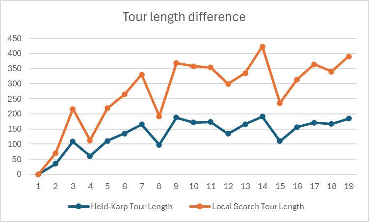
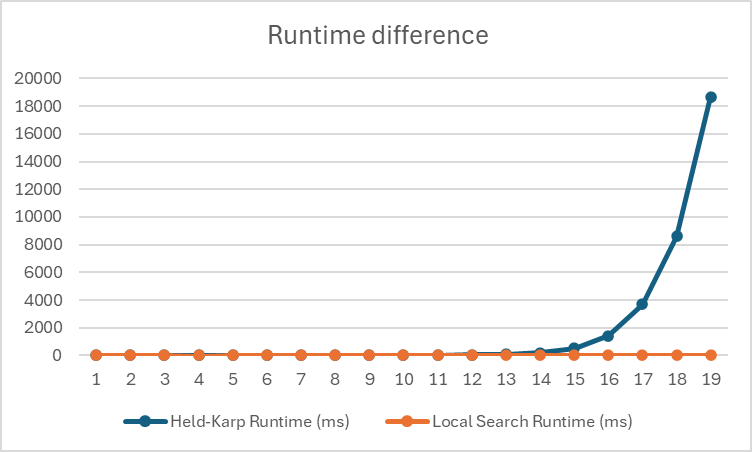

# Traveling Salesperson Problem -- Empirical Analysis

For this exercise, you'll need to take the code from the TSP Held-Karp and TSP
Local Search exercises. This can be your own implementation or somebody else's.
You will now do an empirical analysis of the implementations, comparing their
performance. Both the Held-Karp and the Local Search algorithms solve the same
problem, but they do so in completely different ways. This results in different
solutions, and in different times required to get to the solution.

Investigate the implementations' empirical time complexity, i.e. how the runtime
increases as the input size increases. *Measure* this time by running the code
instead of reasoning from the asymptotic complexity (this is the empirical
part). Create inputs of different sizes and plot how the runtime scales (input
size on the $x$ axis, time on the $y$ axis). Your largest input should have a
runtime of *at least* an hour. The input size that gets you to an hour will
probably not be the same for the Held-Karp and Local Search implementations.

In addition to the measured runtime, plot the tour lengths obtained by both
implementations on the same input distance matrices. The length of the tour that
Held-Karp found should always be less than or equal to the tour length that
Local Search found. Why is this?

Local search may not always find the shortest tour length. SInce we saw that the time complexity of local search contains n!, that since the search size differs so drastically between the two we ca see an obvious difference. Held-Karp does far more work limiting the search space so that it is a guarantee to find the shortest path, this is why it contains a complexity of only n and not the n! that we see in local search. This is why in local search we are only going to be able to find the tour that would greater than or equal to the tour length of the Held-Karp runtime. 

Matrix Size	Held-Karp Runtime (ms)	Held-Karp Tour Length	Local Search Runtime (ms)	Local Search Tour Length
1	0.07	0	0.07	0
2	0.1	35	0.21	35
3	0.16	108	0.05	108
4	0.03	60	0.03	52
5	0.2	111	3.65	108
6	0.17	135	0.24	129
7	1.35	165	1.89	165
8	2.55	98	0.06	94
9	2.53	188	0.09	180
10	7.58	172	0.17	186
11	12.89	173	0.27	181
12	27.18	134	0.12	165
13	63.93	166	0.29	169
14	192.17	191	0.7	232
15	502.07	110	0.44	126
16	1401.04	156	0.96	158
17	3700.53	171	1.78	193
18	8620.31	167	1.88	173
19	18690.19	185	3.25	205

Add the code to run your experiments, graphs, and an explanation of what you did
to this markdown file.

I used Collin Davis's Held-Karp, my own local-search, and swilso59's test code to combine all these results. 

I understand that this does not meet the requirement for the time length, but I wanted to provide a difference between held-karp and local search. 
